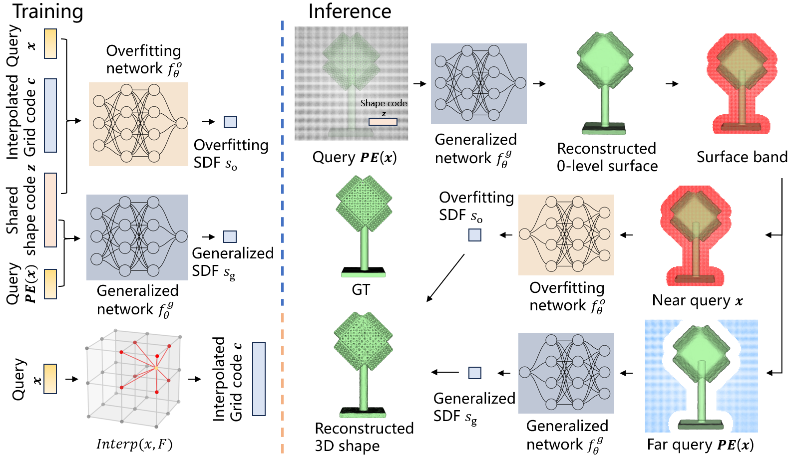

# Compact-SDF
Code for "Learning Compact Latent Space for Representing Neural Signed Distance Functions with High-fidelity Geometry Details" ([https://arxiv.org/pdf/2511.14539](https://arxiv.org/pdf/2511.14539))(AAAI 2026).
## 💡 Abstract
Neural signed distance functions (SDFs) have been a vital representation to represent 3D shapes or scenes with neural networks. An SDF is an implicit function that can query signed distances at specific coordinates for recovering a 3D surface. Although implicit functions work well on a single shape or scene, they pose obstacles when analyzing multiple SDFs with high-fidelity geometry details, due to the non-compact representations of SDFs and the loss of geometry details. To overcome these obstacles, we introduce a method to represent multiple SDFs in a common space, aiming to recover more high-fidelity geometry details with more compact latent representations. Our key idea is to take full advantage of the benefits of generalization-based and overfitting-based learning strategies, which manage to preserve high-fidelity geometry details with compact latent codes. Based on this framework, we also introduce a novel sampling strategy to sample training queries. The sampling can improve the training efficiency and eliminate artifacts caused by the influence of other SDFs. We report numerical and visual evaluations on widely used benchmarks to validate our designs and show advantages over the latest methods in terms of the representative ability and compactness.

## 🖼️ Method Overview
<div align="center">
    
</div>

## 📁 Provided Scripts

- `train_stanford.py` — Train on the **Stanford** dataset([http://graphics.stanford.edu/data/3Dscanrep/](http://graphics.stanford.edu/data/3Dscanrep/))

## 🚀 Example: Single-Object Reconstruction (Stanford Armadillo)

We provide an example using the Armadillo model from the Stanford dataset to demonstrate the training and mesh reconstruction process.

### 1. Prepare the Armadillo Data

Navigate to the `data/` directory and run:

```python
python get_data.py
```

### 2. Training the Armadillo

```python
python train_stanford.py -e examples/Stanford_Armadillo
```

### 3. References
We adapt code from
DeepSDF ([https://github.com/facebookresearch/DeepSDF](https://github.com/facebookresearch/DeepSDF))

Nert-pytorch ([https://github.com/yenchenlin/nerf-pytorch](https://github.com/yenchenlin/nerf-pytorch))

